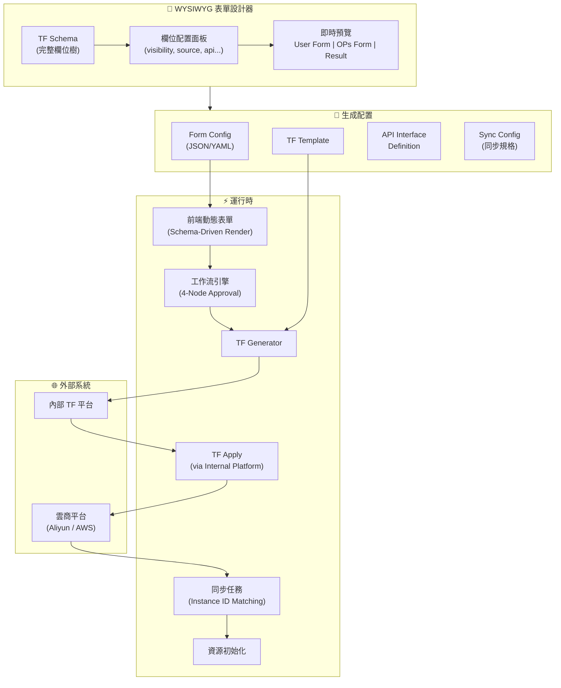
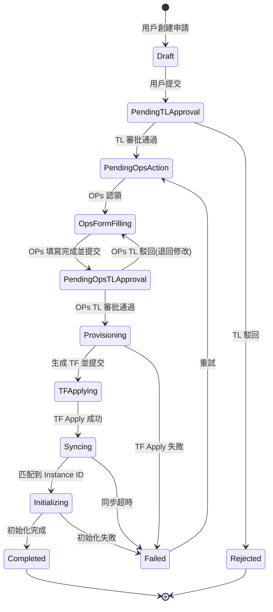
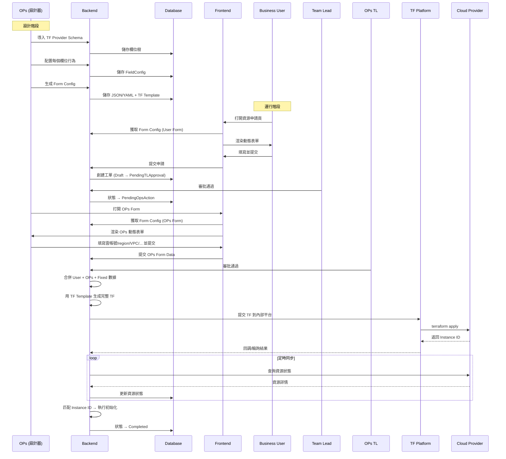

# CloudForm - 系統架構總覽

## 系統定位

CloudForm 是一個 **Terraform Schema-Driven** 的雲資源配置平台。核心理念是：

> **OPs 通過可視化設計器配置 Terraform 欄位行為 → 自動生成 JSON/YAML 表單配置 → 前端零代碼渲染表單 → 用戶填寫 → 審批工作流 → 自動生成 TF → 雲資源創建 → 同步狀態 → 初始化**

## 高階架構圖



## 核心模組

### 1. Terraform Schema Engine
- 解析 Terraform Provider Schema（JSON 格式，由 `terraform providers schema -json` 生成）
- 建立資源欄位樹（支持嵌套 block）
- 欄位元數據：type, required, optional, computed, description, default
- 支持的 Provider：`alicloud`, `aws`

### 2. WYSIWYG Form Designer
- **左側面板**：TF 欄位樹，可展開/折疊，搜索過濾
- **中間面板**：欄位配置（選中欄位後出現）
- **右側面板**：即時預覽，3 個 Tab：
  - User Form（業務用戶看到的表單）
  - OPs Form（OPs 看到的表單）
  - Approval Result（審批結果頁/只讀摘要）

### 3. Field Configuration Model
每個 TF 欄位可配置：

| 屬性 | 類型 | 說明 |
|------|------|------|
| `fieldKey` | string | TF 欄位路徑，如 `instance_type` 或 `vpc_config.vpc_id` |
| `displayName` | string | 前端展示名稱（i18n key） |
| `description` | string | 欄位說明/幫助文本 |
| `formTarget` | enum | `USER_FORM` / `OPS_FORM` / `HIDDEN` / `RESULT_ONLY` |
| `editable` | boolean | 用戶/OPs 是否可編輯 |
| `valueSource` | enum | `FIXED` / `USER_INPUT` / `OPS_INPUT` / `SYSTEM_DEFAULT` / `API_DRIVEN` |
| `fixedValue` | any | 當 valueSource=FIXED 時的固定值（平台級預設） |
| `defaultValue` | any | 表單預設值 |
| `dataSourceApi` | string | 下拉選項的 API 端點 |
| `dataSourceParams` | map | API 請求參數（可引用其他欄位值，如 `${region}`） |
| `componentType` | enum | `INPUT` / `SELECT` / `MULTI_SELECT` / `RADIO` / `SWITCH` / `NUMBER` / `TEXTAREA` |
| `validation` | object | 校驗規則：required, min, max, pattern, custom |
| `order` | int | 表單中的排列順序 |
| `group` | string | 分組名（表單中的 section） |
| `dependsOn` | string[] | 依賴欄位（聯動，如 region 變了要重新拉 VPC） |
| `tfPath` | string | 映射到 TF 的實際路徑 |
| `platformDefault` | boolean | 是否由平台全局配置決定 |

### 4. Workflow Engine


### 5. Config Generation（設計器的輸出）

設計器配置完成後，生成以下產物：

#### a) Form Config (JSON/YAML)
驅動前端零代碼渲染的表單配置文件。

#### b) TF Template
帶有 variable 佔位符的 `.tf` 模板，用於後續填充用戶/OPs 數據後生成實際 TF。

#### c) API Interface Definition
該雲資源需要的後端 API 列表（如 list regions, list vpcs, list instance types），可直接生成 Controller/Service 骨架。

#### d) Sync Config
定義需要從雲商同步什麼數據、用什麼 API、匹配邏輯是什麼。

## 數據流



## 多雲抽象

```
CloudProvider (Interface)
├── AliyunProvider
│   ├── TF Provider: alicloud
│   ├── Resources: alicloud_db_instance, alicloud_elasticsearch, ...
│   └── APIs: Aliyun OpenAPI SDK
└── AWSProvider
    ├── TF Provider: aws
    ├── Resources: aws_db_instance, aws_elasticsearch_domain, ...
    └── APIs: AWS SDK for Java
```

## 目標雲資源矩陣

| 資源類型 | Aliyun TF Resource | AWS TF Resource |
|----------|-------------------|-----------------|
| RDS | `alicloud_db_instance` | `aws_db_instance` |
| Elasticsearch | `alicloud_elasticsearch_instance` | `aws_elasticsearch_domain` |
| Redis | `alicloud_kvstore_instance` | `aws_elasticache_replication_group` |
| MongoDB | `alicloud_mongodb_instance` | `aws_docdb_cluster` |
| ClickHouse | `alicloud_click_house_db_cluster` | `aws_clickhouse_*` (custom) |
