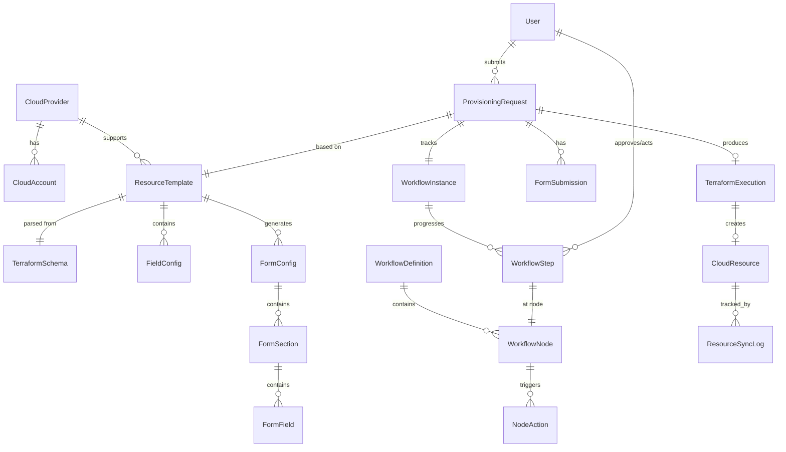

# CloudForm - 資料模型設計

## Entity Relationship



## 核心 Entity 定義

### CloudProvider
```java
public enum CloudProvider {
    ALIYUN("alicloud", "阿里雲"),
    AWS("aws", "Amazon Web Services");

    private final String tfProviderName;
    private final String displayName;
}
```

### ResourceType
```java
public enum ResourceType {
    RDS("關係型數據庫"),
    ELASTICSEARCH("搜索引擎"),
    REDIS("緩存"),
    MONGODB("文檔數據庫"),
    CLICKHOUSE("分析型數據庫");

    private final String displayName;
}
```

### ResourceTemplate
資源模板 - 代表某雲商的某種雲資源的配置模板。

```java
@Entity
@Table(name = "resource_template")
public class ResourceTemplate {
    @Id
    @GeneratedValue(strategy = GenerationType.UUID)
    private UUID id;

    @Enumerated(EnumType.STRING)
    private CloudProvider cloudProvider;

    @Enumerated(EnumType.STRING)
    private ResourceType resourceType;

    private String tfResourceName;        // e.g., "alicloud_db_instance"
    private String displayName;           // e.g., "阿里雲 RDS"
    private String description;
    private String icon;

    @Column(columnDefinition = "jsonb")
    private String tfSchemaJson;          // 原始 TF Schema JSON

    @Column(columnDefinition = "jsonb")
    private String formConfigJson;        // 生成的 Form Config JSON

    @Column(columnDefinition = "text")
    private String tfTemplate;            // 生成的 TF 模板

    @Column(columnDefinition = "jsonb")
    private String syncConfigJson;        // 同步配置

    @Enumerated(EnumType.STRING)
    private TemplateStatus status;        // DRAFT, PUBLISHED, ARCHIVED

    private String createdBy;
    private String updatedBy;
    private LocalDateTime createdAt;
    private LocalDateTime updatedAt;

    @Version
    private Long version;

    @OneToMany(mappedBy = "template", cascade = CascadeType.ALL, orphanRemoval = true)
    private List<FieldConfig> fieldConfigs;
}
```

### FieldConfig
欄位配置 - 設計器中配置的每個 TF 欄位行為。

```java
@Entity
@Table(name = "field_config")
public class FieldConfig {
    @Id
    @GeneratedValue(strategy = GenerationType.UUID)
    private UUID id;

    @ManyToOne(fetch = FetchType.LAZY)
    @JoinColumn(name = "template_id")
    private ResourceTemplate template;

    private String fieldKey;              // 唯一鍵，如 "engine", "vpc_id"
    private String tfPath;                // TF 中的路徑，如 "engine", "vpc_config.vpc_id"
    private String displayName;           // 展示名稱
    private String description;           // 幫助文本
    private String groupKey;              // 分組

    @Enumerated(EnumType.STRING)
    private FormTarget formTarget;        // USER_FORM, OPS_FORM, HIDDEN, RESULT_ONLY

    @Enumerated(EnumType.STRING)
    private ValueSource valueSource;      // FIXED, USER_INPUT, OPS_INPUT, SYSTEM_DEFAULT, API_DRIVEN

    @Enumerated(EnumType.STRING)
    private ComponentType componentType;  // INPUT, SELECT, NUMBER, SWITCH, etc.

    private boolean required;
    private boolean editable;
    private int displayOrder;

    @Column(columnDefinition = "jsonb")
    private String fixedValueJson;        // 固定值

    @Column(columnDefinition = "jsonb")
    private String defaultValueJson;      // 預設值

    @Column(columnDefinition = "jsonb")
    private String dataSourceJson;        // API 數據源配置

    @Column(columnDefinition = "jsonb")
    private String validationJson;        // 校驗規則

    @Column(columnDefinition = "jsonb")
    private String dependsOnJson;         // 依賴欄位列表

    // TF Schema 原始信息（從解析時帶入，只讀參考）
    private String tfType;                // string, number, bool, list, map, set
    private boolean tfRequired;
    private boolean tfComputed;
    private String tfDefault;
}
```

### Enums

```java
public enum FormTarget {
    USER_FORM,      // 出現在用戶表單
    OPS_FORM,       // 出現在 OPs 表單
    HIDDEN,         // 不出現在任何表單（固定值或系統計算）
    RESULT_ONLY     // 只出現在審批結果頁（只讀）
}

public enum ValueSource {
    FIXED,           // 平台預設固定值
    USER_INPUT,      // 用戶填寫
    OPS_INPUT,       // OPs 填寫
    SYSTEM_DEFAULT,  // 系統計算的預設值
    API_DRIVEN       // 由 API 返回決定
}

public enum ComponentType {
    INPUT,           // 文本輸入
    TEXTAREA,        // 多行文本
    NUMBER,          // 數字輸入
    SELECT,          // 單選下拉
    MULTI_SELECT,    // 多選下拉
    RADIO,           // 單選按鈕組
    CHECKBOX,        // 多選框組
    SWITCH,          // 開關
    DATE,            // 日期
    PASSWORD,        // 密碼（加密存儲）
    READONLY         // 只讀展示
}
```

### ProvisioningRequest
資源配置請求 - 一次完整的雲資源申請生命週期。

```java
@Entity
@Table(name = "provisioning_request")
public class ProvisioningRequest {
    @Id
    @GeneratedValue(strategy = GenerationType.UUID)
    private UUID id;

    private String requestNo;             // 工單號，如 CR-2025-00001

    @ManyToOne(fetch = FetchType.LAZY)
    @JoinColumn(name = "template_id")
    private ResourceTemplate template;

    @Enumerated(EnumType.STRING)
    private RequestStatus status;

    @Column(columnDefinition = "jsonb")
    private String userFormDataJson;      // 用戶表單數據

    @Column(columnDefinition = "jsonb")
    private String opsFormDataJson;       // OPs 表單數據

    @Column(columnDefinition = "jsonb")
    private String mergedTfVarsJson;      // 合併後的 TF variables

    @Column(columnDefinition = "text")
    private String generatedTf;           // 最終生成的 TF 代碼

    private String tfExecutionId;         // 內部 TF 平台的執行 ID
    private String cloudInstanceId;       // 雲商返回的 Instance ID

    private String applicantId;
    private String applicantName;
    private String applicantTeam;

    private LocalDateTime createdAt;
    private LocalDateTime updatedAt;
    private LocalDateTime completedAt;
}

public enum RequestStatus {
    DRAFT,
    PENDING_TL_APPROVAL,
    TL_APPROVED,
    PENDING_OPS_ACTION,
    OPS_FORM_FILLING,
    PENDING_OPS_TL_APPROVAL,
    OPS_TL_APPROVED,
    PROVISIONING,
    TF_APPLYING,
    SYNCING,
    INITIALIZING,
    COMPLETED,
    FAILED,
    REJECTED,
    CANCELLED
}
```

### WorkflowInstance & WorkflowStep
```java
@Entity
@Table(name = "workflow_instance")
public class WorkflowInstance {
    @Id
    @GeneratedValue(strategy = GenerationType.UUID)
    private UUID id;

    @OneToOne(fetch = FetchType.LAZY)
    @JoinColumn(name = "request_id")
    private ProvisioningRequest request;

    private String currentNodeKey;        // 當前節點
    private LocalDateTime startedAt;
    private LocalDateTime completedAt;

    @OneToMany(mappedBy = "workflowInstance", cascade = CascadeType.ALL)
    @OrderBy("createdAt ASC")
    private List<WorkflowStep> steps;
}

@Entity
@Table(name = "workflow_step")
public class WorkflowStep {
    @Id
    @GeneratedValue(strategy = GenerationType.UUID)
    private UUID id;

    @ManyToOne(fetch = FetchType.LAZY)
    @JoinColumn(name = "workflow_instance_id")
    private WorkflowInstance workflowInstance;

    private String nodeKey;               // APPLICANT, APPLICANT_TL, OPS, OPS_TL
    private String action;                // SUBMIT, APPROVE, REJECT, REASSIGN

    @Column(columnDefinition = "text")
    private String comment;               // 審批意見

    private String actorId;
    private String actorName;

    private LocalDateTime createdAt;
}
```

### CloudAccount
```java
@Entity
@Table(name = "cloud_account")
public class CloudAccount {
    @Id
    @GeneratedValue(strategy = GenerationType.UUID)
    private UUID id;

    @Enumerated(EnumType.STRING)
    private CloudProvider provider;

    private String accountId;             // 雲商帳號 ID
    private String accountName;           // 顯示名稱
    private String accessKeyId;           // 加密存儲
    private String accessKeySecret;       // 加密存儲
    private boolean active;

    private LocalDateTime createdAt;
    private LocalDateTime updatedAt;
}
```

## Database Schema (DDL)

```sql
-- 使用 PostgreSQL + JSONB

CREATE TABLE resource_template (
    id UUID PRIMARY KEY DEFAULT gen_random_uuid(),
    cloud_provider VARCHAR(20) NOT NULL,
    resource_type VARCHAR(30) NOT NULL,
    tf_resource_name VARCHAR(100) NOT NULL,
    display_name VARCHAR(200) NOT NULL,
    description TEXT,
    icon VARCHAR(50),
    tf_schema_json JSONB,
    form_config_json JSONB,
    tf_template TEXT,
    sync_config_json JSONB,
    status VARCHAR(20) NOT NULL DEFAULT 'DRAFT',
    created_by VARCHAR(100),
    updated_by VARCHAR(100),
    created_at TIMESTAMP NOT NULL DEFAULT NOW(),
    updated_at TIMESTAMP NOT NULL DEFAULT NOW(),
    version BIGINT NOT NULL DEFAULT 0,
    UNIQUE(cloud_provider, tf_resource_name)
);

CREATE TABLE field_config (
    id UUID PRIMARY KEY DEFAULT gen_random_uuid(),
    template_id UUID NOT NULL REFERENCES resource_template(id) ON DELETE CASCADE,
    field_key VARCHAR(100) NOT NULL,
    tf_path VARCHAR(200),
    display_name VARCHAR(200),
    description TEXT,
    group_key VARCHAR(50),
    form_target VARCHAR(20) NOT NULL,
    value_source VARCHAR(20) NOT NULL,
    component_type VARCHAR(20) NOT NULL DEFAULT 'INPUT',
    required BOOLEAN NOT NULL DEFAULT FALSE,
    editable BOOLEAN NOT NULL DEFAULT TRUE,
    display_order INT NOT NULL DEFAULT 0,
    fixed_value_json JSONB,
    default_value_json JSONB,
    data_source_json JSONB,
    validation_json JSONB,
    depends_on_json JSONB,
    tf_type VARCHAR(20),
    tf_required BOOLEAN DEFAULT FALSE,
    tf_computed BOOLEAN DEFAULT FALSE,
    tf_default TEXT,
    UNIQUE(template_id, field_key)
);

CREATE TABLE provisioning_request (
    id UUID PRIMARY KEY DEFAULT gen_random_uuid(),
    request_no VARCHAR(20) NOT NULL UNIQUE,
    template_id UUID NOT NULL REFERENCES resource_template(id),
    status VARCHAR(30) NOT NULL DEFAULT 'DRAFT',
    user_form_data_json JSONB,
    ops_form_data_json JSONB,
    merged_tf_vars_json JSONB,
    generated_tf TEXT,
    tf_execution_id VARCHAR(100),
    cloud_instance_id VARCHAR(100),
    applicant_id VARCHAR(100) NOT NULL,
    applicant_name VARCHAR(100),
    applicant_team VARCHAR(100),
    created_at TIMESTAMP NOT NULL DEFAULT NOW(),
    updated_at TIMESTAMP NOT NULL DEFAULT NOW(),
    completed_at TIMESTAMP
);

CREATE TABLE workflow_instance (
    id UUID PRIMARY KEY DEFAULT gen_random_uuid(),
    request_id UUID NOT NULL UNIQUE REFERENCES provisioning_request(id),
    current_node_key VARCHAR(30),
    started_at TIMESTAMP NOT NULL DEFAULT NOW(),
    completed_at TIMESTAMP
);

CREATE TABLE workflow_step (
    id UUID PRIMARY KEY DEFAULT gen_random_uuid(),
    workflow_instance_id UUID NOT NULL REFERENCES workflow_instance(id),
    node_key VARCHAR(30) NOT NULL,
    action VARCHAR(20) NOT NULL,
    comment TEXT,
    actor_id VARCHAR(100) NOT NULL,
    actor_name VARCHAR(100),
    created_at TIMESTAMP NOT NULL DEFAULT NOW()
);

CREATE TABLE cloud_account (
    id UUID PRIMARY KEY DEFAULT gen_random_uuid(),
    provider VARCHAR(20) NOT NULL,
    account_id VARCHAR(100) NOT NULL,
    account_name VARCHAR(200) NOT NULL,
    access_key_id VARCHAR(200),
    access_key_secret VARCHAR(200),
    active BOOLEAN NOT NULL DEFAULT TRUE,
    created_at TIMESTAMP NOT NULL DEFAULT NOW(),
    updated_at TIMESTAMP NOT NULL DEFAULT NOW(),
    UNIQUE(provider, account_id)
);

-- Indexes
CREATE INDEX idx_field_config_template ON field_config(template_id);
CREATE INDEX idx_provisioning_request_status ON provisioning_request(status);
CREATE INDEX idx_provisioning_request_applicant ON provisioning_request(applicant_id);
CREATE INDEX idx_workflow_step_instance ON workflow_step(workflow_instance_id);
```
