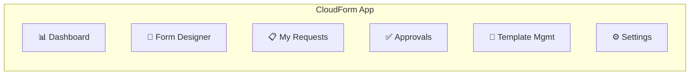

# CloudForm - 前端設計規劃

## 頁面結構



## 核心頁面

### 1. WYSIWYG Form Designer（核心頁面）

```
┌─────────────────────────────────────────────────────────────────────┐
│ CloudForm Designer    [Save Draft] [Preview] [Generate] [Publish]  │
│ Template: Aliyun RDS  │ Status: Draft                              │
├────────────────┬────────────────────┬───────────────────────────────┤
│                │                    │                               │
│  TF 欄位樹     │  欄位配置面板       │  即時預覽                      │
│  ──────────    │  ──────────────    │  ──────────                   │
│                │                    │  ┌─────────────────────────┐  │
│  🔍 搜索欄位   │  欄位: engine      │  │[User Form][OPs Form]   │  │
│                │                    │  │[Approval Result]        │  │
│  ▼ Root        │  ┌──────────────┐  │  ├─────────────────────────┤  │
│    ☑ engine    │  │ 展示名稱     │  │  │                         │  │
│    ☑ engine_v  │  │ [數據庫引擎]  │  │  │  ┌─ 基本信息 ─────────┐ │  │
│    ☑ inst_type │  ├──────────────┤  │  │  │                     │ │  │
│    ☑ inst_stor │  │ 目標表單     │  │  │  │ 數據庫引擎  [MySQL▾] │ │  │
│    ☐ zone_id   │  │ ○ User Form  │  │  │  │                     │ │  │
│    ☐ vswitch   │  │ ● OPs Form   │  │  │  │ 引擎版本    [8.0 ▾] │ │  │
│    ☐ security  │  │ ○ Hidden     │  │  │  │                     │ │  │
│    ▼ vpc_conf  │  │ ○ Result Only│  │  │  └─────────────────────┘ │  │
│      ☐ vpc_id  │  ├──────────────┤  │  │                         │  │
│      ☐ sub_id  │  │ 值來源       │  │  │  ┌─ 規格配置 ─────────┐ │  │
│    ▼ tags      │  │ ○ Fixed      │  │  │  │                     │ │  │
│      ☐ key     │  │ ● User Input │  │  │  │ 實例規格  [4C8G  ▾] │ │  │
│      ☐ value   │  │ ○ OPs Input  │  │  │  │                     │ │  │
│                │  │ ○ Sys Default │  │  │  │ 存儲空間  [100] GB  │ │  │
│  ──────────    │  ├──────────────┤  │  │  │                     │ │  │
│  Legend:       │  │ 組件類型     │  │  │  │ 節點數    [3]       │ │  │
│  ☑ Configured  │  │ [SELECT   ▾] │  │  │  └─────────────────────┘ │  │
│  ☐ Not config  │  ├──────────────┤  │  │                         │  │
│                │  │ 數據源       │  │  │  [保存草稿]  [提交申請]  │  │
│                │  │ ● Static     │  │  │                         │  │
│                │  │ ○ API        │  │  └─────────────────────────┘  │
│                │  │              │  │                               │
│                │  │ Options:     │  │                               │
│                │  │ MySQL        │  │                               │
│                │  │ PostgreSQL   │  │                               │
│                │  │ MariaDB      │  │                               │
│                │  ├──────────────┤  │                               │
│                │  │ 校驗規則     │  │                               │
│                │  │ ☑ Required   │  │                               │
│                │  │ ☑ Editable   │  │                               │
│                │  ├──────────────┤  │                               │
│                │  │ 依賴欄位     │  │                               │
│                │  │ [engine    ] │  │                               │
│                │  └──────────────┘  │                               │
├────────────────┴────────────────────┴───────────────────────────────┤
│ Status: 12 fields configured / 45 total  │  Last saved: 10:30 AM  │
└─────────────────────────────────────────────────────────────────────┘
```

### 2. 動態表單（運行時）

前端根據 Form Config JSON 渲染，零硬編碼：

```
┌───────────────────────────────────────────────┐
│ 雲數據庫申請 - Aliyun RDS                      │
│ 工單號: CR-2025-00042                          │
├───────────────────────────────────────────────┤
│                                               │
│  ┌─ 基本信息 ──────────────────────────────┐  │
│  │                                         │  │
│  │  數據庫引擎        [MySQL         ▾]    │  │
│  │  引擎版本          [8.0           ▾]    │  │
│  │                                         │  │
│  └─────────────────────────────────────────┘  │
│                                               │
│  ┌─ 規格配置 ──────────────────────────────┐  │
│  │                                         │  │
│  │  實例規格          [rds.mysql.s3.large▾] │  │
│  │                    4 vCPU / 8 GB         │  │
│  │  存儲空間 (GB)     [100         ]       │  │
│  │                    20 ~ 6000, step: 10   │  │
│  │  預計節點數         [3           ]       │  │
│  │                                         │  │
│  └─────────────────────────────────────────┘  │
│                                               │
│          [保存草稿]    [提交申請]              │
│                                               │
└───────────────────────────────────────────────┘
```

### 3. 審批頁面

```
┌───────────────────────────────────────────────────────┐
│ 工單審批 - CR-2025-00042                               │
├───────────────────────────────────────────────────────┤
│                                                       │
│  工作流進度:                                           │
│  ●─────────●─────────○─────────○                      │
│  申請人     申請人TL   OPs       OPs TL                │
│  ✅ 已提交  ⏳ 待審批  ⬜ 待操作  ⬜ 待審批              │
│                                                       │
│  ┌─ 申請摘要 ────────────────────────────────────┐    │
│  │ 資源類型: Aliyun RDS                          │    │
│  │ 數據庫引擎: MySQL 8.0                          │    │
│  │ 實例規格: 4 vCPU / 8 GB                       │    │
│  │ 存儲空間: 100 GB                               │    │
│  │ 預計節點數: 3                                   │    │
│  │ 申請人: 張三 / Backend Team                    │    │
│  │ 申請時間: 2025-01-15 10:30                     │    │
│  └────────────────────────────────────────────────┘   │
│                                                       │
│  ┌─ 審批意見 ────────────────────────────────────┐    │
│  │ [                                             ]    │
│  │ [                                             ]    │
│  └────────────────────────────────────────────────┘   │
│                                                       │
│       [駁回]    [轉交]    [通過]                       │
│                                                       │
│  ┌─ 審批歷史 ────────────────────────────────────┐    │
│  │ 🟢 張三 提交申請  2025-01-15 10:30            │    │
│  │    "請幫忙開通 RDS 用於新項目"                  │    │
│  └────────────────────────────────────────────────┘   │
│                                                       │
└───────────────────────────────────────────────────────┘
```

## 前端技術架構

### 組件層次

```
App
├── Layout (Sidebar + Header + Content)
├── Pages
│   ├── Dashboard
│   ├── Designer (WYSIWYG)
│   │   ├── SchemaTreePanel
│   │   │   ├── SearchFilter
│   │   │   └── FieldTreeNode (recursive)
│   │   ├── FieldConfigPanel
│   │   │   ├── BasicConfig (name, description, group)
│   │   │   ├── FormTargetConfig (user/ops/hidden/result)
│   │   │   ├── ValueSourceConfig (fixed/input/api)
│   │   │   ├── ComponentTypeConfig (select/input/number...)
│   │   │   ├── DataSourceConfig (static options / API endpoint)
│   │   │   ├── ValidationConfig (required, min, max, pattern)
│   │   │   └── DependencyConfig (dependsOn fields)
│   │   └── PreviewPanel
│   │       ├── PreviewTabs (User Form / OPs Form / Result)
│   │       └── DynamicFormPreview
│   ├── Requests
│   │   ├── RequestList
│   │   ├── RequestCreate (DynamicForm - User Form)
│   │   └── RequestDetail
│   ├── Approvals
│   │   ├── ApprovalList
│   │   └── ApprovalDetail (with DynamicForm readonly + actions)
│   └── Templates
│       ├── TemplateList
│       └── TemplateDetail
├── Shared Components
│   ├── DynamicForm (核心：Schema-Driven 表單渲染器)
│   │   ├── DynamicField (根據 componentType 渲染對應組件)
│   │   ├── FormSection (分組)
│   │   └── FieldDependencyManager (聯動管理)
│   ├── WorkflowTimeline (工作流進度條)
│   ├── CodePreview (TF 代碼預覽)
│   └── DataTable (通用表格)
└── Hooks
    ├── useDynamicForm (表單邏輯)
    ├── useFieldDependencies (欄位聯動)
    ├── useDataSource (API 數據源)
    └── useWorkflow (工作流操作)
```

### 關鍵 React Hooks

```typescript
// useDynamicForm - 核心 hook，驅動整個動態表單
function useDynamicForm(formConfig: FormDefinition) {
  // 管理所有欄位的值
  // 處理欄位聯動 (dependsOn)
  // 調用 API 數據源
  // 表單校驗
  // 返回: values, errors, setFieldValue, validateAll, submitForm
}

// useFieldDependencies - 欄位聯動
function useFieldDependencies(fields: FieldConfig[], values: Record<string, any>) {
  // 監聽依賴欄位變化
  // 清空下游欄位值
  // 觸發 API 重新加載
}

// useDataSource - API 數據源加載
function useDataSource(config: DataSourceConfig, params: Record<string, any>) {
  // 根據 config.type 決定 static/api
  // API 模式：用 params 替換 ${xxx} 佔位符
  // 返回: options, isLoading, error
}
```

## 設計系統

使用 shadcn/ui 為基礎，擴展以下組件：

### 主題色調
```css
/* Dark mode first, 科技感 */
--primary: 220 70% 50%;         /* 主色：科技藍 */
--primary-foreground: 0 0% 98%;
--secondary: 260 60% 45%;       /* 次色：紫色 */
--accent: 170 80% 45%;          /* 強調：青綠 */
--background: 220 20% 8%;       /* 深色背景 */
--card: 220 20% 12%;            /* 卡片背景 */
--muted: 220 15% 20%;           /* 次級元素 */
```

### 自定義組件
- `SchemaTree`: 基於 shadcn Tree + 自定義拖拽
- `FieldConfigurator`: 多面板配置器
- `LivePreview`: iframe 隔離的即時預覽
- `WorkflowStepper`: 工作流步驟可視化
- `CodeEditor`: Monaco Editor 嵌入（TF 代碼預覽/編輯）

## 狀態管理

```
Zustand Store
├── designerStore
│   ├── currentTemplate
│   ├── selectedField
│   ├── fieldConfigs (Map<fieldKey, FieldConfig>)
│   ├── previewTab ('user' | 'ops' | 'result')
│   └── isDirty
├── requestStore
│   ├── currentRequest
│   ├── formValues
│   └── workflowStatus
└── authStore
    ├── currentUser
    └── permissions
```
