# CloudForm - 開發路線圖

## Phase 概覽

```mermaid
gantt
    title CloudForm 開發路線圖（相對天數，D = 啟動日）
    dateFormat  X
    axisFormat  D+%s

    section Phase 1 - 基礎
    專案初始化 & 腳手架           :p1a, 0, 3d
    資料庫 Schema & Entity       :p1b, after p1a, 3d
    TF Schema 解析引擎           :p1c, after p1b, 5d
    基本 REST API (Template CRUD):p1d, after p1b, 3d

    section Phase 2 - 設計器
    前端腳手架 & 設計系統         :p2a, after p1d, 3d
    SchemaTree 組件              :p2b, after p2a, 3d
    FieldConfig 面板             :p2c, after p2b, 5d
    即時預覽面板                 :p2d, after p2c, 4d
    Form Config 生成             :p2e, after p2d, 3d

    section Phase 3 - 工作流
    動態表單渲染器(DynamicForm)   :p3a, after p2e, 5d
    欄位聯動引擎                 :p3b, after p3a, 3d
    工作流引擎                   :p3c, after p3a, 5d
    審批頁面                     :p3d, after p3c, 3d

    section Phase 4 - 集成
    TF 生成 & 提交               :p4a, after p3d, 5d
    雲商數據同步                 :p4b, after p3d, 5d
    資源狀態追蹤                 :p4c, after p4a, 3d

    section Phase 5 - 完善
    多雲資源模板(RDS/ES/Redis...)  :p5a, after p4c, 7d
    Dashboard & 監控             :p5b, after p4c, 3d
    權限 & 安全加固              :p5c, after p5b, 3d
```

## Phase 1: Foundation（基礎建設）

### 目標
搭建項目骨架，完成核心數據模型和 TF Schema 解析。

### 任務清單
- [ ] **P1.1** 項目初始化
  - [ ] Spring Boot 3.x + Java 17 項目（Gradle）
  - [ ] React + Vite + TypeScript 項目
  - [ ] shadcn/ui 初始化 + 主題配置
  - [ ] Docker Compose (PostgreSQL + Redis)
  - [ ] 基本 CI 配置
- [ ] **P1.2** 數據庫 & Entity
  - [ ] DDL scripts (Flyway migration)
  - [ ] JPA Entities + Repositories
  - [ ] 基本 seed data
- [ ] **P1.3** TF Schema 解析引擎
  - [ ] 解析 `terraform providers schema -json` 的 JSON 輸出
  - [ ] 建立欄位樹數據結構（支持嵌套 block）
  - [ ] 提取欄位元數據（type, required, computed, default, description）
  - [ ] 支持 `alicloud` 和 `aws` provider
- [ ] **P1.4** 基礎 API
  - [ ] Template CRUD endpoints
  - [ ] Schema import endpoint
  - [ ] OpenAPI/Swagger 配置

### 交付物
- 可運行的前後端項目
- 數據庫已建表
- 可以導入 TF Schema 並查看欄位樹

---

## Phase 2: WYSIWYG Designer（表單設計器）

### 目標
完成核心的 WYSIWYG 表單設計器。

### 任務清單
- [ ] **P2.1** 前端基礎
  - [ ] Layout (Sidebar + Header + Content)
  - [ ] 路由配置
  - [ ] API client (axios + React Query)
  - [ ] 設計系統 tokens（顏色、字體、間距）
- [ ] **P2.2** Schema Tree Panel
  - [ ] 樹形展示 TF 欄位
  - [ ] 搜索過濾
  - [ ] 已配置/未配置狀態標記
  - [ ] 點擊選中欄位
- [ ] **P2.3** Field Config Panel
  - [ ] 基本信息配置（名稱、描述、分組）
  - [ ] 目標表單選擇（User/OPs/Hidden/Result）
  - [ ] 值來源配置（Fixed/Input/API）
  - [ ] 組件類型選擇
  - [ ] 靜態選項配置
  - [ ] API 數據源配置（endpoint, params, mapping）
  - [ ] 校驗規則配置
  - [ ] 欄位依賴配置
  - [ ] 排序（drag & drop）
- [ ] **P2.4** Preview Panel
  - [ ] Tab 切換（User Form / OPs Form / Result）
  - [ ] 即時渲染表單預覽
  - [ ] 響應式預覽
- [ ] **P2.5** Config Generation
  - [ ] 後端：根據 FieldConfig 生成 Form Config JSON
  - [ ] 後端：生成 TF 模板
  - [ ] 後端：生成 API 接口定義
  - [ ] 後端：生成同步配置
  - [ ] 前端：生成結果展示 + 下載
- [ ] **P2.6** Cross-Provider 產品族（規劃中）
  - [ ] `ResourceTemplate.familyKey` + `familyDisplayName`（不引新表的最小化方案）
  - [ ] TemplatesListPage 按 familyKey 聚合，卡片內顯示 ALIYUN / AWS 變體 chip
  - [ ] DesignerPage 加 provider toggle，切換時載入對應 template 的欄位配置
  - [ ] User Form 預覽預設只顯示 USER_FORM target 欄位；OPs Form 預覽顯示 USER_FORM ∪ OPS_FORM
  - [ ] 「Unmapped Configs」section 升格為「Custom Fields」並提供顯式新增
  - [ ] 設計：跨 provider 共用欄位語義的標記方式（先用 `groupKey` 約定，再考慮 SharedFieldDefinition 表）

### 交付物
- 完整的 WYSIWYG 設計器
- 可以配置欄位並即時預覽
- 可以生成 Form Config JSON
- 同產品族跨 provider 切換配置

---

## Phase 3: Workflow & Dynamic Form（工作流 & 動態表單）

### 目標
實現運行時的動態表單和審批工作流。

### 任務清單
- [ ] **P3.1** DynamicForm 組件
  - [ ] 根據 Form Config JSON 渲染表單
  - [ ] 支持所有 ComponentType
  - [ ] Section 分組展示
  - [ ] 表單校驗（客戶端 + 服務端）
- [ ] **P3.2** 欄位聯動引擎
  - [ ] dependsOn 監聽
  - [ ] 級聯清空
  - [ ] API 數據源動態加載
  - [ ] 變量替換 `${fieldKey}`
- [ ] **P3.3** 工作流引擎
  - [ ] 4 節點審批鏈
  - [ ] 狀態機實現
  - [ ] 節點間 Action hooks
  - [ ] 審批/駁回/轉交
  - [ ] 審批歷史記錄
- [ ] **P3.4** 前端頁面
  - [ ] 資源申請頁（User Form）
  - [ ] 我的申請列表
  - [ ] 待審批列表
  - [ ] 審批詳情頁（含工作流進度、表單只讀、操作按鈕）
  - [ ] OPs 操作頁（OPs Form）

### 交付物
- 完整的申請 → 審批流程
- 動態表單可正常渲染和提交
- 欄位聯動正常運作

---

## Phase 4: Integration（集成對接）

### 目標
對接內部 TF 平台和雲商 API。

### 任務清單
- [ ] **P4.1** TF 生成 & 提交
  - [ ] 合併 User + OPs + Fixed 數據生成 TF variables
  - [ ] 用 TF Template 生成完整 `.tf` 文件
  - [ ] 調用內部平台 API 提交 TF
  - [ ] 處理回調/輪詢結果
- [ ] **P4.2** 雲商數據同步
  - [ ] Aliyun OpenAPI 集成（Regions, VPCs, Zones, Instance Types...）
  - [ ] AWS SDK 集成
  - [ ] 定時同步任務（Spring Scheduled）
  - [ ] 同步數據本地緩存
- [ ] **P4.3** 資源狀態追蹤
  - [ ] Instance ID 匹配邏輯
  - [ ] 資源狀態輪詢
  - [ ] 初始化觸發
  - [ ] 失敗重試機制

### 交付物
- 端到端流程打通
- 可以從申請到資源創建全自動化

---

## Phase 5: Polish & Scale（完善 & 擴展）

### 目標
增加更多雲資源模板，完善監控和安全。

### 任務清單
- [ ] **P5.1** 多雲資源模板
  - [ ] Aliyun RDS (MySQL, PostgreSQL)
  - [ ] Aliyun Elasticsearch
  - [ ] Aliyun Redis
  - [ ] Aliyun MongoDB
  - [ ] Aliyun ClickHouse
  - [ ] AWS RDS
  - [ ] AWS ElastiCache (Redis)
  - [ ] AWS OpenSearch (ES)
- [ ] **P5.2** Dashboard
  - [ ] 資源配置統計
  - [ ] 審批效率指標
  - [ ] 資源成本概覽
  - [ ] 最近活動
- [ ] **P5.3** 安全 & 權限
  - [ ] RBAC 權限模型
  - [ ] 操作審計日誌
  - [ ] 敏感欄位加密
  - [ ] API Rate Limiting

### 交付物
- 生產就緒的完整平台
- 覆蓋主流雲資源

---

## 開發建議

### 先做什麼？
**建議從 Phase 1 + Phase 2 開始**，因為表單設計器是核心價值，驗證了整個 Schema-Driven 的思路是否可行。一旦設計器能生成正確的 Form Config JSON，後續的動態渲染、工作流、TF 生成都是圍繞這個 JSON 展開的。

### 技術風險
1. **TF Schema 解析**：不同 provider 的 schema 結構可能有差異，需要早期驗證
2. **欄位聯動性能**：大量欄位的級聯更新可能有性能問題
3. **內部 TF 平台集成**：需要確認 API 規格和認證方式
